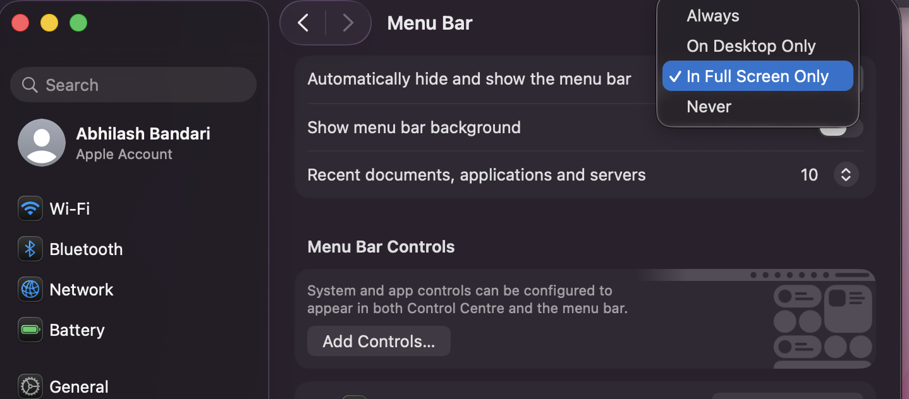
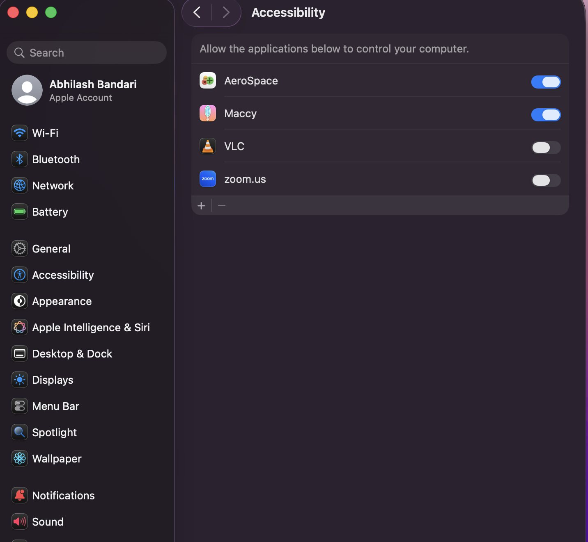
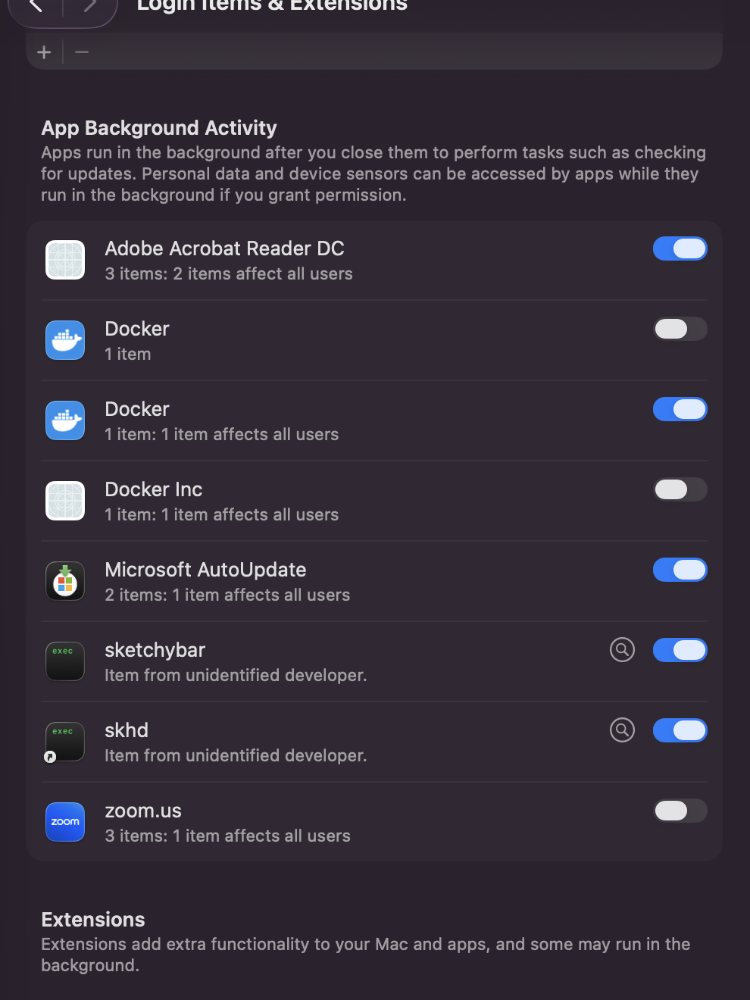

# macOS Dotfiles

My personal macOS setup — a tiling window manager, a custom status bar, and keyboard-driven everything. No mouse needed for 90% of what I do. If you've been wanting to clean up your mac workflow, this is a good starting point.

Built around [AeroSpace](https://github.com/nikitabobko/AeroSpace), [SketchyBar](https://github.com/FelixKratz/SketchyBar), and [skhd](https://github.com/koekeishiya/skhd). Managed with [GNU Stow](https://www.gnu.org/software/stow/) so everything stays version-controlled and portable.

---

## What's included

- **AeroSpace** — tiling window manager. Windows snap into a grid automatically. Switch workspaces and move windows around without touching the mouse.
- **SketchyBar** — replaces the default macOS menu bar with a floating, blurred bar that actually shows useful stuff (workspaces, Wi-Fi, battery, volume, current app).
- **skhd** — global hotkeys for launching apps and controlling the environment.

---

## Installation

Clone it anywhere — the script detects its own location automatically:

```bash
git clone https://github.com/bandari-abhilash/dotfiles.git 
cd ~/dotfiles
chmod +x install.sh
./install.sh
```

> You can clone it to `~/dotfiles`, `~/Desktop/dotfiles`, or anywhere else — it doesn't matter.

The script will:
1. Install Homebrew if it's not already there
2. Tap `felixkratz/formulae`, `nikitabobko/tap`, and `koekeishiya/formulae`
3. Install `stow`, `jq`, `sketchybar`, `skhd`, and `aerospace`
4. Install Hack Nerd Font and the sketchybar-app-font
5. Symlink all configs into `~/.config` via GNU Stow
6. Start SketchyBar and skhd as background services
7. Walk you through granting Accessibility permissions

If anything fails midway, the script rolls back everything it changed — no half-installed state left behind.

---

## Post-install: Permissions


## Screenshots

**Replacing the system menu bar with SketchyBar** — set it to hide "In Full Screen Only" so they don't overlap:



**Granting Accessibility permission to AeroSpace** — required for it to move and resize windows:



**skhd showing up in Login Items** — this confirms it's running as a background service:



---

Two things need Accessibility access. macOS will prompt you, but here's what to expect.

### AeroSpace

Go to **System Settings → Privacy & Security → Accessibility** and toggle AeroSpace on. You should see it appear there automatically after first launch.


### skhd

skhd doesn't always appear in the Accessibility list automatically. If it's missing:

1. Click `+` in the Accessibility list
2. **Press `Cmd + Shift + G`** in the file picker (this lets you type a custom path)
3. Type `/opt/homebrew/bin` → hit Enter → select `skhd` → click Open
4. Toggle it ON

After adding it, restart the service:
```bash
skhd --restart-service
```

You can also confirm skhd is running by checking **System Settings → General → Login Items & Extensions** — it should appear under background items:


---

## Hiding the native menu bar

Since SketchyBar takes over the top of the screen, you'll want to hide the default macOS menu bar so they don't overlap. Go to **System Settings → Desktop & Dock → Menu Bar** and set "Automatically hide and show the menu bar" to **In Full Screen Only**:


---

## Keybindings

### AeroSpace — Window & Workspace Management

| Shortcut | Action |
|----------|--------|
| `Alt + H/J/K/L` | Focus window left/down/up/right |
| `Alt + Shift + H/J/K/L` | Move window left/down/up/right |
| `Alt + 1–7` | Switch to workspace 1–7 |
| `Alt + Shift + 1–7` | Move window to workspace 1–7 |
| `Alt + /` | Toggle split orientation (horizontal ↔ vertical) |
| `Alt + ,` | Toggle accordion layout |
| `Alt + F` | macOS native fullscreen |
| `Alt + Shift + Space` | Toggle float/tile for current window |
| `Alt + Tab` | Jump to previous workspace |
| `Alt + Shift + Tab` | Move workspace to next monitor |
| `Alt + Shift + R` | Reload AeroSpace config |

### skhd — App Launchers & Quick Actions

| Shortcut | Action |
|----------|--------|
| `Alt + Return` | Open Terminal |
| `Alt + B` | Open Brave Browser |
| `Alt + A` | Open Arc |
| `Alt + C` | Open Cursor |
| `Alt + P` | Open Postman |
| `Alt + S` | Open Slack |
| `Alt + Shift + S` | Reload skhd config |
| `Alt + Shift + B` | Reload SketchyBar |
| `Alt + Shift + T` | Toggle SketchyBar position (top ↔ bottom) |

---

## App workspace assignments

Apps automatically land on their designated workspace when opened:

| App | Workspace |
|-----|-----------|
| Terminal | 1 |
| Arc | 2 |
| Brave | 3 |
| Slack | 4 |
| Postman | 7 |

Configure this in `aerospace/.config/aerospace/aerospace.toml` under the `[[on-window-detected]]` blocks at the bottom.

---

## Theming

There's a simple theme switcher that swaps both the SketchyBar color palette and the desktop wallpaper at once.

Available themes: `catppuccin` (Macchiato) and `tokyo-night`

```bash
~/dotfiles/bin/set-theme tokyo-night
~/dotfiles/bin/set-theme catppuccin
```

---

## How editing works (GNU Stow)

Every config file in this repo is symlinked into your `~/.config` folder. So `~/.config/aerospace/aerospace.toml` is just a pointer to the actual file inside `dotfiles/`.

**Always edit from the `dotfiles/` side** — that's what git tracks:

| Tool | Edit this file |
|------|----------------|
| AeroSpace | `aerospace/.config/aerospace/aerospace.toml` |
| SketchyBar | `sketchybar/.config/sketchybar/sketchybarrc` |
| skhd | `skhd/.config/skhd/skhdrc` |

No need to re-run stow after editing. Changes take effect immediately (or after reloading the relevant service).

---

## Folder structure

```
dotfiles/
├── aerospace/
│   └── .config/
│       └── aerospace/
│           └── aerospace.toml        # Tiling layout, keybindings, workspace rules
├── sketchybar/
│   └── .config/
│       └── sketchybar/
│           ├── sketchybarrc          # Bar entry point
│           ├── colors.sh             # Color palette
│           ├── icons.sh              # Nerd Font icon map
│           ├── items/                # Bar items (spaces, battery, wifi, etc.)
│           └── plugins/              # Scripts that power each item
├── skhd/
│   └── .config/
│       └── skhd/
│           └── skhdrc                # Global hotkeys
├── themes/
│   ├── catppuccin.sh
│   ├── tokyo-night.sh
│   └── backgrounds/
│       └── tokyo-night.png
├── bin/
│   └── set-theme                     # Theme switcher script
└── install.sh                        # One-click installer with rollback
```

---

## Troubleshooting

### "No available formula" or "CommandLineTools" error during install
If the script fails with an error like `No available formula with the name` or explicitly hints at Xcode Command Line Tools, macOS is missing the required C-compiler to build SketchyBar/skhd.

Fix this by reinstalling the Xcode Command Line Tools:
```bash
sudo rm -rf /Library/Developer/CommandLineTools
sudo xcode-select --install
```
A prompt will appear — click **Install**. Once the download finishes, re-run `./install.sh`.
